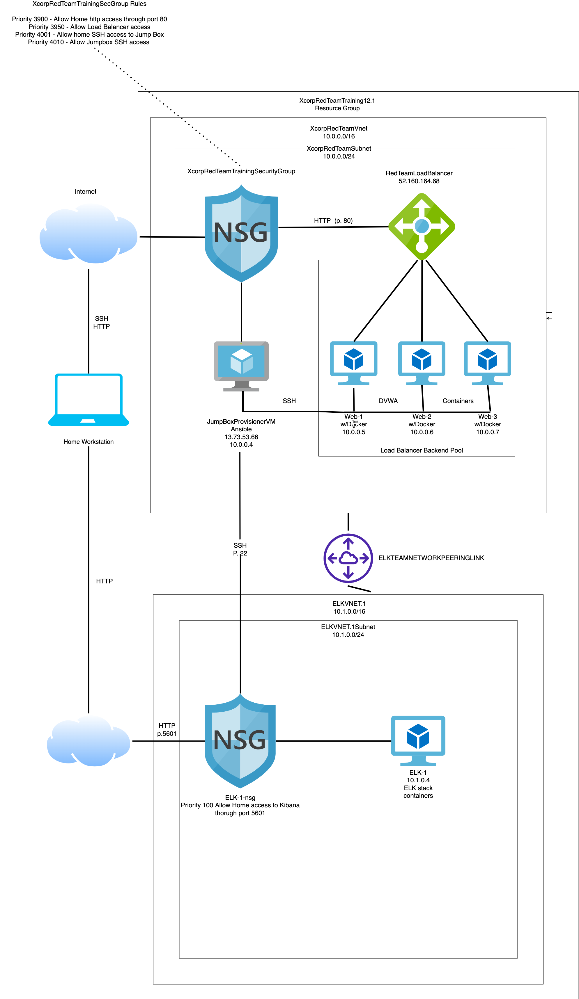
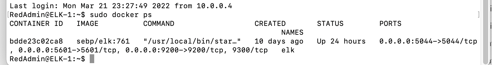

## Automated ELK Stack Deployment

The files in this repository were used to configure the network depicted below.

These files have been tested and used to generate a live ELK deployment on Azure. They can be used to either recreate the entire deployment pictured above. Alternatively, select portions of the yaml file may be used to install only certain pieces of it, such as Filebeat.

  - [ELK Installation](https://github.com/AndyTalbott/ELK_Stack_Project/blob/main/Ansible/install-elk.yml)
  - [Docker Configuration](https://github.com/AndyTalbott/ELK_Stack_Project/blob/main/Ansible/pentest.yml)
  - [Filebeat Installation](https://github.com/AndyTalbott/ELK_Stack_Project/blob/main/Ansible/filebeat-playbook.yml)
  - [Metricbeat Installation](https://github.com/AndyTalbott/ELK_Stack_Project/blob/main/Ansible/metricbeat-playbook.yml)

This document contains the following details:
- Description of the Topologu
- Access Policies
- ELK Configuration
  - Beats in Use
  - Machines Being Monitored
- How to Use the Ansible Build

### Description of the Topology

The main purpose of this network is to expose a load-balanced and monitored instance of DVWA, the D*mn Vulnerable Web Application.

Load balancing ensures that the application will be highly available, in addition to restricting acess to the network.
Load Balancers help distribute traffic evenly across web servers and help to mitigate DOS attacks. The advantage of a jump box is that it allows us to maintain a controlled source of access to a network

Integrating an ELK server allows users to easily monitor the vulnerable VMs for changes to the logs and system metrics.
- Filebeat has been installed to watch for changes to files
- Metricbeat has been installed to record machine metrics such as uptime

The configuration details of each machine may be found below.

| Name     | Function | IP Address | Operating System |
|----------|----------|------------|------------------|
| Jump Box | Gateway  | 10.0.0.4   | Linux            |
| Web1     | WebServer| 10.0.0.5   | Linux            |
| Web2     | WebServer| 10.0.0.6   | Linux            |
| Web3     | WebServer| 10.0.0.7   | Linux            |
| ELK-1    | Monitor  | 10.1.0.4   | Linux            | 

### Access Policies

The machines on the internal network are not exposed to the public Internet. 

Only the Jump box machine can accept connections from the Internet. Access to this machine is only allowed from the following IP addresses:
- My Public IP Address

Machines within the network can only be accessed by SSH.
- The machine that was allowed to access my ELK VM was my Jump box machine.  It has a Private IP address of 10.0.0.4

A summary of the access policies in place can be found in the table below.

| Name               | Publicly Accessible|       Allowed IP Addresses        |
|--------------------|--------------------|-----------------------------------|
| Jump Box           | Yes                | My Home IP Address                |
| Web1               | No                 | Jump box, Load Balancer           |
| Web2               | No                 | Jump box, Load Balancer           |
| Web3               | No                 | Jump box, Load Balancer           |
| ELK-1              | Yes                | My Home IP Address, Jump box      |
| LoadBalancer       | Yes                | My Home IP Address                |
### Elk Configuration

Ansible was used to automate configuration of the ELK machine. No configuration was performed manually, which is advantageous because...
- The main advantage of automating configuration with Ansible is that it takes out the element of human error and that it is scalable.

The playbook implements the following tasks:
- ... Uses apt to install docker.io
- ... Uses apt to install pip3
- ... Uses pip to install docker python module
- ... Uses sysctl to increase memory

The following screenshot displays the result of running `docker ps` after successfully configuring the ELK instance.

### Target Machines & Beats
This ELK server is configured to monitor the following machines:
- Web1 10.0.0.5
- Web2 10.0.0.6
- Web3 10.0.0.7

We have installed the following Beats on these machines:
- Filebeat
- Metricbeat

These Beats allow us to collect the following information from each machine:
- _TODO: In 1-2 sentences, explain what kind of data each beat collects, and provide 1 example of what you expect to see. E.g., `Winlogbeat` collects Windows logs, which we use to track user logon events, etc._
- Filebeat reports changes to log files. For example it would report any changes that would be made to /etc/passwd/
- Metricbeat collects machine metrics.  It could report if a VM's CPU is nearing its max.

### Using the Playbook
In order to use the playbook, you will need to have an Ansible control node already configured. Assuming you have such a control node provisioned: 

SSH into the control node and follow the steps below:
- Copy the playbook file to /etc/ansible/.
- Update the hosts file to include the IP addresses of the machines we want the playbook to run on.
- Run the playbook, and navigate to HTTP://ELK.VM.Pub.IP:5601/app/kibana to check that the installation worked as expected.

- Install-ELK.yml is the name of the actual playbook.  It is copied into etc/ansible/
- _Which file do you update to make Ansible run the playbook on a specific machine? The file that we updated to run the ansible playbook on a specific machine is the hosts file. How do I specify which machine to install the ELK server on versus which to install Filebeat on? Which servers or group of servers to install the ELK server or the Filebeat to is specified in the playbook under hosts.
- _Which URL do you navigate to in order to check that the ELK server is running? HTTP://ELK.VM.Pub.IP:5601/app/kibana
